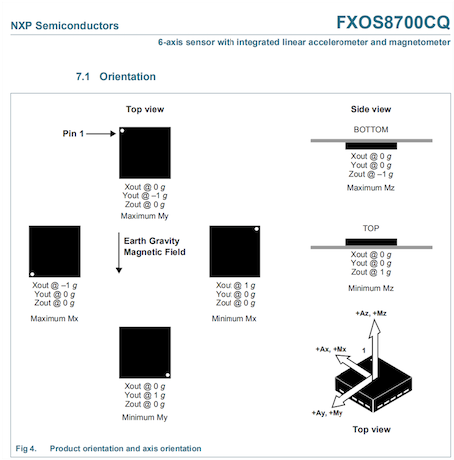

## Air Mouse Execution Environment Setup
### Download MCUXpresso IDE
* The MCUXpresso IDE is an Eclipse-based development environment for NXP MCUs based on Arm Cortex-M cores. This IDE is compatible with Windows, Linux, and OS X. Before you download the MCUXpresso IDE, you need to create a NXP account. 

* You can [download the IDE here!](https://www.nxp.com/design/software/development-software/mcuxpresso-software-and-tools/mcuxpresso-integrated-development-environment-ide:MCUXpresso-IDE)

### Download SDK inside the MCUXpresso IDE
* The default workspace is in Documents folder in C Disk. You can either select this workspace or a particular folder. I use the default workspace for this project. 
* In the center of the **Welcome Page**, hit the **Download and Install SDKs** button. You will need to select **frdmk64f** as the board type. 

### Copy the Project into the Project Explorer
* Close the Welcome Page, you can see the **Project Explorer** column on the left. If you do not see it, enter "Project Explorer" in **Quick Access** located on the top right corner. 
* Drag the project folder (unzip it first) into the **Project Explorer**
* Click on **Copy** so the project will be available inside. 

*Make Sure the folder you copy into the Project Explorer does not contain an extra directory.*

### Build and Run 
* Right click on the folder's name, select **Build Project**
* Select **GUI Flash Tool** in the tool bar (a gray icon looks like a notebook)
* Select the board that is connected to the PC. (*Make sure to use the port right next to the SW1 of the board.*)
* Hit **OK** and **Run**

If you receive an error message, please try close the other projects and select **clean project** for this particular project. (Both **Close Project** and **Clean Project** can be found by right clicking on the folder's name) 

The code will be successfully loaded into the board. 

### Play With the Air Mouse
* Connect the USB cable to the other port, from which the computer will recognize the board as a mouse.
* Press SW3 for about 3 seconds and release. When you see the **blue LED** flashes, rotate the board around the three axis.
* If you see the **green LED** after the blue LED, this means the board is successfully calibrated. Otherwise, you will the **red LED**.
* Press SW3 again but shortly, if you see the **red LED** turns on, you can move the board and the cursor will move accordingly. (Rotate around y-axis will move the cursor up and down, while rotate around z-axis will move the cursor right and left. The 6-axis orientation is shown below)

* Again, if you press the SW3, the **red LED** turns off, which means the mouse is disconneted to the computer. 

### Performance
Please visit our [Air Mouse Wiki Site!](https://pages.github.coecis.cornell.edu/ece3140-sp2020/yj89-zc96/)

